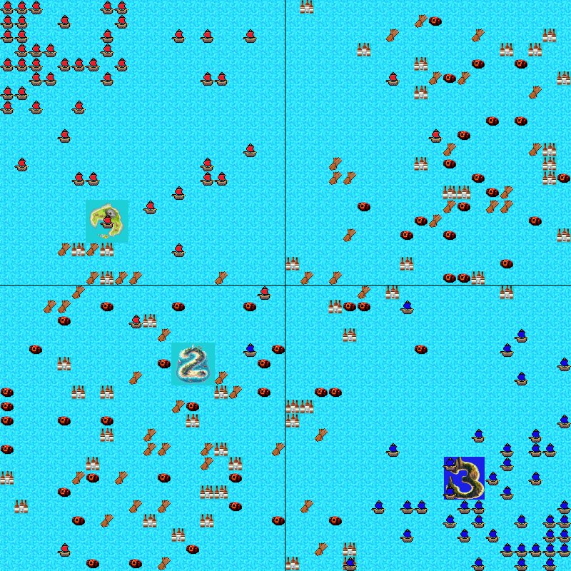
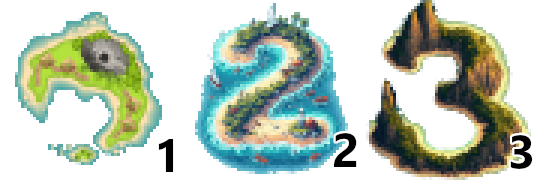
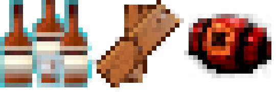
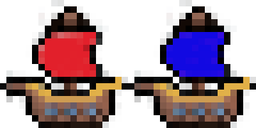

# Game Overview
 - [Map](#map)
  - [Team](#team)
  - [Islands](#islands)
  - [Resources](#resources)
    - [Rum](#rum)
    - [Wood](#wood)
    - [Gunpowder](#gunpowder)
  - [Pirates](#pirates)
  - [Communication Between Team and Pirates](#communication-between-team-and-pirates)
## Map

The Map is a randomly generated square grid of tiles (typically `40 x 40`), that contain 3 islands of size `3 x 3`, and collectible resources scattered across most of the remaining tiles.

The islands are spawned such that on symmetrically dividing the map into 4 quadrants, 3 of them have islands. The two opposite corners of the map in quadrants with islands are chosen, and set as the deploy points for each team's pirates (the location where new pirates are spawned). 

> _A screenshot of the Map mid-game, with lines drawn to show the 4 quadrants_

Whenever a pirate (or pirates) land on a tile with a resource, it gets distributed between both teams depending on the proportion of pirates present at that spot, and the resource is exhausted.

Most of these resources are not replenished (see [Resources](#resources)).

## Team

There are two teams in the game: **Red** and **Blue**

At the start of the team, both of the two teams are provided with `400` Rum, `150` Wood and `500` Gunpowder. Each team is also assigned one deploy point (see [Map](#map)).

Note that a team does not refer to just a collection of pirates of the same color, but is also a separate entity in the game that can take actions that concern all its pirates as a whole.

It is capable of communicating with its pirates via [signals](#communication-between-team-and-pirates). It is also responsible for building walls around the island to prevent other pirates from entering.

## Islands
There are three islands in the game, numbered 1, 2 and 3. Each of them has a distinct shape.

A team is said to exclusively occupy an island if:
- Alteast one pirate from the team is present on any of the 9 tiles of the island
- No pirates from the other team are present on any of the tiles of the island

If a team exclusively occupies any island for `150` continuous cycles, they **capture** the island.

## Resources

There are 3 resources that you will find scattered the map. Resources are collected by a team when their pirates move onto tiles that contain them. These resources are **shared commonly by the whole team**, and play different roles in the game:

### Rum

Rum is used to spawn more pirates at the team's deploy point. It is used automatically on collection, and each pirate costs `50` Rum. 

Each tile of Rum can give a total of `75` Rum. Rum is never replenished, and is thus a limited resource on the Map.

### Wood
Wood is used to build walls around islands the team is occupying. Building walls costs `50` Wood, and the team must decide when to use this resource. 

When walls are built around an island, pirates within the walls cannot leave the island and pirates from outside cannot enter the island. A team can build walls around an island only if there are no enemy pirates in that island.

Walls around an island are automatically dissolved after `50` timeframes.

Each island also has a cooldown period of `35` timeframes, during which walls cannot be built around it.

Each tile of Wood can give a total of `25` Wood. Wood is never replenished, and is thus a limited resource on the Map.

### Gunpowder
Gunpowder is an important resource used in battles, when pirates come in contact with each other <u>i.e.</u> move onto the same tile.

If the pirate's team has atleast `100` Gunpowder, then the pirate destroys the enemy pirate.

More specifically, if both teams have atleast `100` gunpowder, both pirates are killed. If only one team has atleast `100` gunpowder, only the enemy pirate is killed. If both teams have less than `100` gunpowder, neither pirate is killed.

Each tile of Gunpowder can give a total of `50` Gunpowder. Gunpowder is periodically replenished on the Map if its amount falls below a certain threshold.

## Pirates

Pirates are the functional units of a team that explore the map, collect resources and capture islands.

The primary action that a pirate can perform is to **move**, and to decide where to move it can investigate its surroundings and communicate with its team via signals.

Each pirate occupies exactly one tile at any time, and any tile that has one or more pirates from a team will have a ship displayed on it.

## Communication Between Team and Pirates

A **signal** is simply put, a message that can be used as a means of communication and as a store of information between cycles.

There are two types of signals in the game:

1. **Pirate signals**, that belong to a pirate specifically. Each pirate has one, and only they can change its value. Both they and their team can read this signal.
2. **Team signals**, that belong to the team. The team and all the pirates in it can both read and change this signal.

These signals can be used to co-ordinate movements and strategize attacks/defence.
