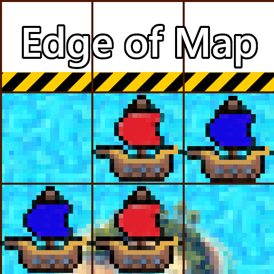

# Pirate Methods

Since these are methods of the `Pirate` class, you will need to call them using dot notation on a member of this class, that is a variable that is expected to be a `Pirate`, like the parameter of `ActPirate`.

For example:
```py
def ActPirate(pirate):
    # If there is no wall above, move upward
    if pirate.investigate_up() != "wall":
        return 1; # Up
    else:
        return 0; # No movement
```

## Investigation

A pirate is able to investigate the tile it is on, and all 8 tiles surrounding it, by which it can find out what lies in those tiles.
Tiles are referred to based on their direction with respect to the pirate.


- **`investigate_current()`** : This function is used to investigate the current location of the pirate.

- **`investigate_up()`** : This function is used to investigate the area above the current location of the pirate.

- **`investigate_left()`** : This function is used to investigate the area to the left of the current location of the pirate.

- **`investigate_down()`** : This function is used to investigate the area below the current location of the pirate.

- **`investigate_right()`** : This function is used to investigate the area to the right of the current location of the pirate.

- **`investigate_ne()`** : This function is used to investigate the area in the northeast direction of the current location of the pirate.

- **`investigate_nw()`** : This function is used to investigate the area in the northwest direction of the current location of the pirate.

- **`investigate_se()`** : This function is used to investigate the area in the southeast direction of the current location of the pirate.

- **`investigate_sw()`** : This function is used to investigate the area in the southwest direction of the current location of the pirate.

Each of the above functions returns a tuple of two strings `(where, who)`, `where` representing the type of the tile, and `who` the presence of pirates:

`where` can take the following values:
- ***'wall'*** if the tile is out of bounds
- ***'island1', 'island2' or 'island3'*** if the tile is a part of an island
- ***'blank'*** in all other cases (<u>i.e.</u> the sea)

`who` can take the following values:
- ***'friend'*** if only pirates from the same team are on the tile
- ***'enemy'*** if only pirates from the other team are on the tile
- ***'both'*** if pirates from both teams are on the tile
- ***'blank'*** in all other cases (<u>i.e.</u> no pirates)

For example:



```py
# The 'pirate' variable here refers to the pirate at the centre
pirate.investigate_down()    # ('island2', 'friend')
pirate.investigate_up()      # ('wall', 'blank')
pirate.investigate_left()    # ('blank', 'blank')
pirate.investigate_right()   # ('blank', 'enemy')
sw = pirate.investigate_sw() # ('island2', 'enemy')

sw[0] # 'island2'
sw[1] # 'enemy'
```

## Signalling

### `getSignal()`
Returns the current signal of the pirate.

### `setSignal(sig)`
Sets the signal of the pirate to `sig` if `sig` is a string and its length is less than or equal to 100.

### `getTeamSignal()`
Returns the current signal of the team.

### `setTeamSignal(sig)`
Sets the signal of the pirate's team to `sig` if `sig` is a string and its length is less than or equal to 100.

## Info

### `trackPlayers()`
Returns a list of length 6, containing info on the current status of all the islands.

The first three items correspond to the occupation of Island 1, 2 and 3 respectively by the pirate's team, and can take values `''`, `'myCapturing'` and `'myCaptured'`.

The last three items correspond to the occupation of Island 1, 2 and 3 respectively by other team, and can take values `''`, `'oppCapturing'` and `'oppCaptured'`.

Example:
```py
# All islands have been taken by opponent
pirate.trackPlayers() # ['','','','oppCaptured','oppCaptured','oppCaptured']

# Island 1 is yours, Island 2 is the opponent's but you are currently trying to capture it
pirate.trackPlayers() # ['myCaptured','myCapturing','','','oppCaptured','']
```

### `getTotalRum()`
Returns the total amount of rum the team has.

### `getTotalGunpowder()`
Returns the total amount of gunpowder the team has.

### `getTotalWood()`
Returns the total amount of wood the team has.

### `getPosition()`
Returns the position of the pirate as a tuple `(x, y)`. 

### `getDeployPoint()`
Returns the coordinates of the deploy point of the team as a tuple `(x, y)`.

### `getID()`
Returns a string that uniquely identifies a pirate from each team, corresponding to the order of its creation

### `getDimensionX()`
Returns the X dimension of the game.

### `getDimensionY()`
Returns the Y dimension of the game.

### `getCurrentFrame()`
Returns the current time frame of the game
