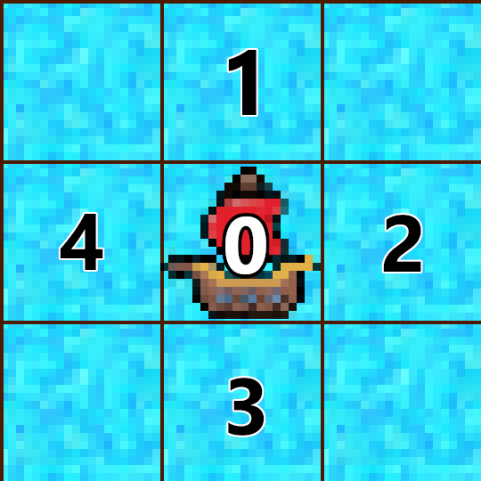

# Script Structure
The script you use is expected to have the following 3 parts:

```py
# A name to identify your script, which is your team name
name = 'team'

# A function that takes a pirate as an argument, and returns an integer between 0 and 4
# Ran on every pirate on your team, to decide where they will move to. 
# Can investigate surrounding tiles, set its signals and team signal in the process
def ActPirate(pirate):
    ...

# A function that takes a team as an argument, and is not expected to return anything
# Ran on your team, to change team signals and to build walls
def ActTeam(team):
    ...
```

You are free to define any helper functions you like to help you with designing `ActPirate` and `ActTeam`. 

The values 0 to 4 that are returned by `ActPirate` each correspond to one of the 5 possible moves a pirate can make every cycle:

0 - **Don't move (Stay at current)**  
1 - **Move UP**  
2 - **Move RIGHT**  
3 - **Move DOWN**  
4 - **Move LEFT**  



Some recommended modules you could use in your scripts:
- random
- math
- numpy
